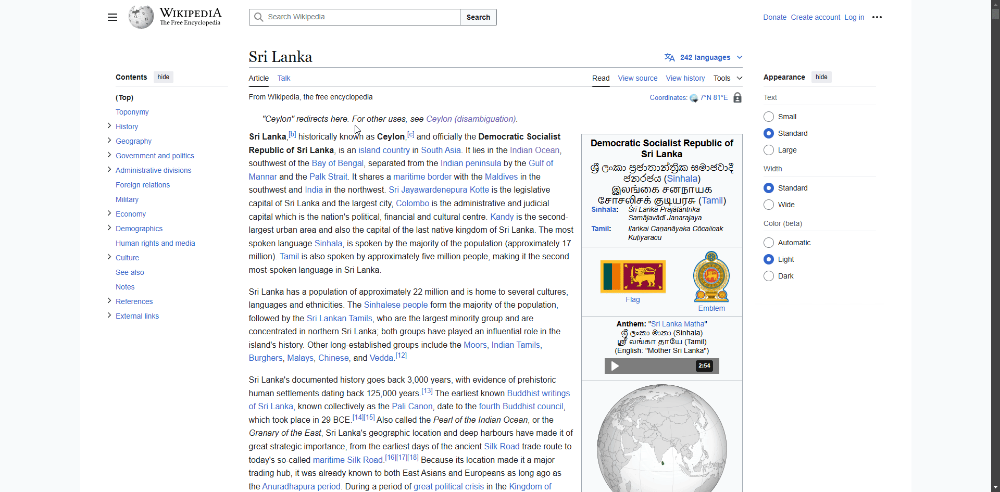
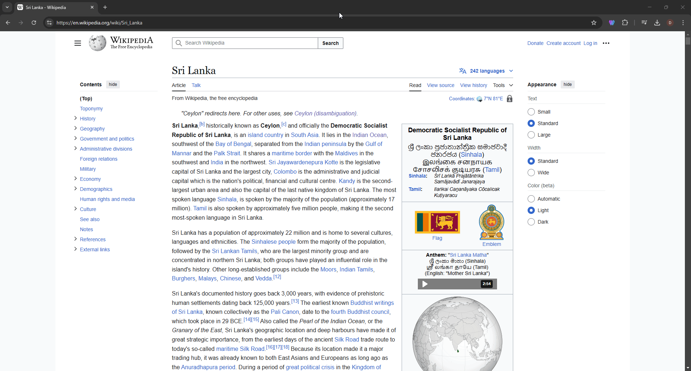

# SummaryWiz


SummaryWiz is a Chrome extension that summarizes webpage content using Gemini AI and allows users to save summaries to Firebase. The extension also features selected text summarization, text-to-speech (TTS), and a history of saved summaries.

## Features

- Summarize entire webpages with a single click.
- Summarize selected text via right-click context menu.
- Save summaries to Firebase with domain details.
- Text-to-speech (TTS) for audio summaries.
- Copy summary with a single click.
- Customizable summary length (Short, Medium, Detailed).
- Modern UI with smooth animations.
- Auto-redirects from empty tabs to a predefined website.

## Demo





## Installation

1. Download or Clone this repository to your local machine:

```bash
   git clone https://github.com/IT21036620/SummaryWiz.git
```
2. Navigate to chrome://extensions/ in your Google Chrome browser.
3. Enable "Developer mode" in the top-right corner.
4. Click "Load unpacked" and select the directory where you cloned or downloaded the repository.
5. The extension icon should now appear in your Chrome toolbar.
6. Right-click the extension icon and choose "Options", then enter your Gemini AI API key.

## Configuration (Get a Gemini API Key)

1. Go to the Google AI Studio.
2. Sign in with your Google account.
3. Create a new project (if you don't have one already).
4. Generate an API key for Gemini:
5. Navigate to the API Keys section.
6. Click Create API Key and copy the key.

## Usage

### Summarize a Full Webpage
1. Open any webpage.
2. Click on the SummaryWiz extension icon.
3. The summary will be generated and displayed in the popup.
4. Click Save to store it in Firebase.
5. Use the 🔊 TTS button to listen to the summary.
6. Use the 📋 button to copy the summary text.
7. If the tab is empty it will redirect to predifined website

### Summarize Selected Text
1. Highlight any text on a webpage.
2. Right-click and select "Summarize Selected text".
3. A popup overlay will appear with the summary.

### View & Manage Saved Summaries
1. Go to options of the extention.
2. Click on "Check Saved Summaries"
3. All the saved summaries will be listed and option to delete

## Technogies Used
- Chrome Extension API (Manifest v3)
- Google Gemini AI API (For summarization)
- Firebase Firestore (For storing summaries)
- JavaScript, HTML, CSS (For UI & interactivity)